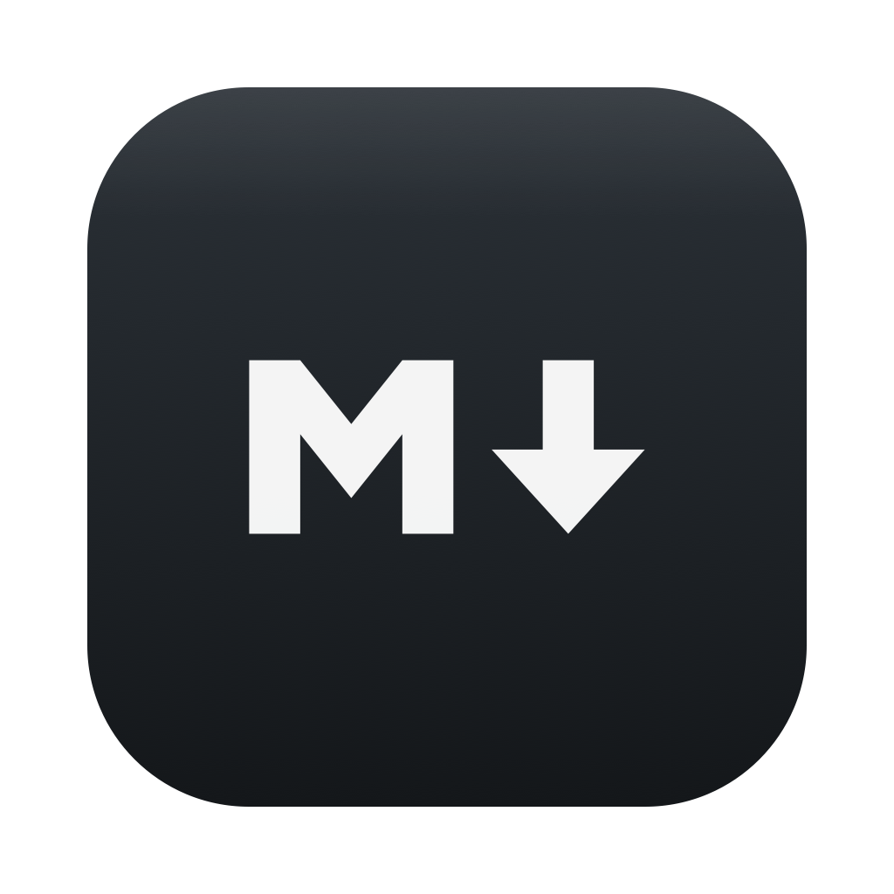

<p align="center"></p>

# MDView

[](https://github.com/TKirmani/mdview/actions/workflows/ci.yml)

[](LICENSE)

A tiny native macOS Markdown viewer/editor. **172 KB binary, &lt;1 MB total** — no Electron, no runtimes.

- **Double-click any `.md` file** → rendered preview (registers as a Markdown editor with Finder)
- **Complete GFM rendering**: tables, task lists, images, strikethrough, footnotes, syntax-highlighted code blocks
- **Edit mode**: ⌘E toggles a plain-text editor, ⌘S saves (autosave/recents come from macOS)
- **Quick Look extension**: spacebar previews and Finder's preview pane render through the same pipeline
- GitHub-style light/dark theme, follows the system appearance
- Opens maximized; quits when the last window closes

Rendering is [marked](https://github.com/markedjs/marked) + [highlight.js](https://github.com/highlightjs/highlight.js) running locally (bundled, zero network at runtime) inside a WKWebView / JavaScriptCore. See [THIRD_PARTY_LICENSES.md](THIRD_PARTY_LICENSES.md).

## Build

Requires macOS 13+ and the Xcode Command Line Tools (full Xcode not needed).

```sh
./build.sh
```

Produces `build/MDView.app` (ad-hoc codesigned).

## Install

1. Copy `build/MDView.app` to `/Applications` and launch it once.
2. Make it the default for Markdown: right-click any `.md` file → Get Info → Open with → MDView → **Change All**.
3. Quick Look: if spacebar still shows plain text, enable **MDView** under System Settings → General → Login Items & Extensions → Quick Look.

> **Downloaded a prebuilt .app?** It is ad-hoc signed, so Gatekeeper will block the first launch: right-click → Open → Open (or `xattr -d com.apple.quarantine MDView.app`). Building from source avoids this.

## Known limits

- Relative-path images render in the app, but not in Quick Look previews (needs QL attachments — noted in code).
- arm64 only as built; Intel needs a rebuild on x86_64.

## License

MIT — see [LICENSE](LICENSE). Bundled renderer libraries are MIT/BSD, see [THIRD_PARTY_LICENSES.md](THIRD_PARTY_LICENSES.md).
